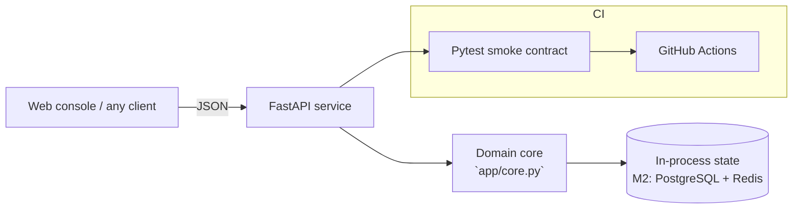

# SENTINEL — Agentic Incident Commander

**Domain:** Agentic AI · AIOps · Multi-Agent Systems

## Problem

On-call engineers drown in alert noise; most incidents follow known diagnose→mitigate playbooks that humans execute manually at 3 a.m.

## Solution

An autonomous incident commander: a plan→act→observe agent loop over a typed tool registry (diagnose, mitigate, escalate) with a full per-step execution trace. The deterministic planner is a drop-in slot for a LangGraph LLM planner — same tool contracts, auditable traces either way.

## Why this project for the **App Engineer (AI & Automation)** role at **LaunchDarkly**

This system was scoped to demonstrate, end to end, the skills the job description emphasises: **Agentic AI, MCP**. Milestone M1 is fully implemented and tested in this repo; M2–M4 are the documented growth path.

## Architecture



The core is intentionally dependency-free (FastAPI + stdlib) so it runs
anywhere in seconds; every integration point for production hardening is
marked in the milestone plan.

## API surface

| Method | Path |
|---|---|
| `GET` | `/health` |
| `POST` | `/api/incidents` |
| `GET` | `/api/incidents` |

Interactive docs: `http://localhost:8000/docs`

## Quickstart

```bash
cd backend
pip install -r requirements.txt
uvicorn app.main:app --reload          # http://localhost:8000
python -m pytest -q                    # smoke contract
```

Or with Docker:

```bash
docker compose up --build
```

## Impact

- Converts known-pattern incidents from ~20-minute manual runbooks into sub-second automated traces
- Every action is logged with tool, output and latency — auditability that pure-LLM agents lack

## Roadmap

- M1 (shipped): agent loop, tool registry, execution traces, incident API + UI
- M2: LangGraph planner with LLM reasoning + human-approval interrupts for critical actions
- M3: real signal ingestion (Prometheus/Alertmanager webhook) + MCP tool servers
- M4: post-incident report generation and Slack/n8n notification flows

## Tech & concepts

Agentic AI, LangGraph, LangChain, Function Calling, MCP, CrewAI, Monitoring & Observability, Anomaly Detection, n8n, Kubernetes, CI/CD, Security
